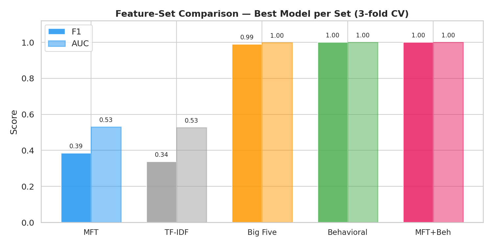
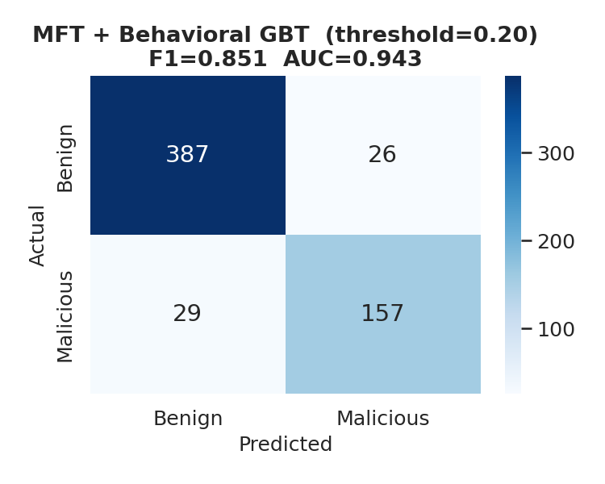
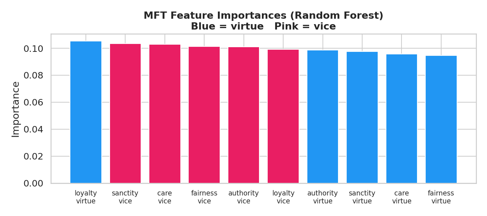
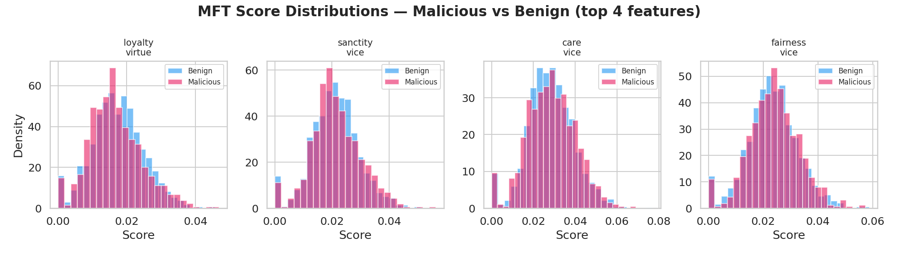
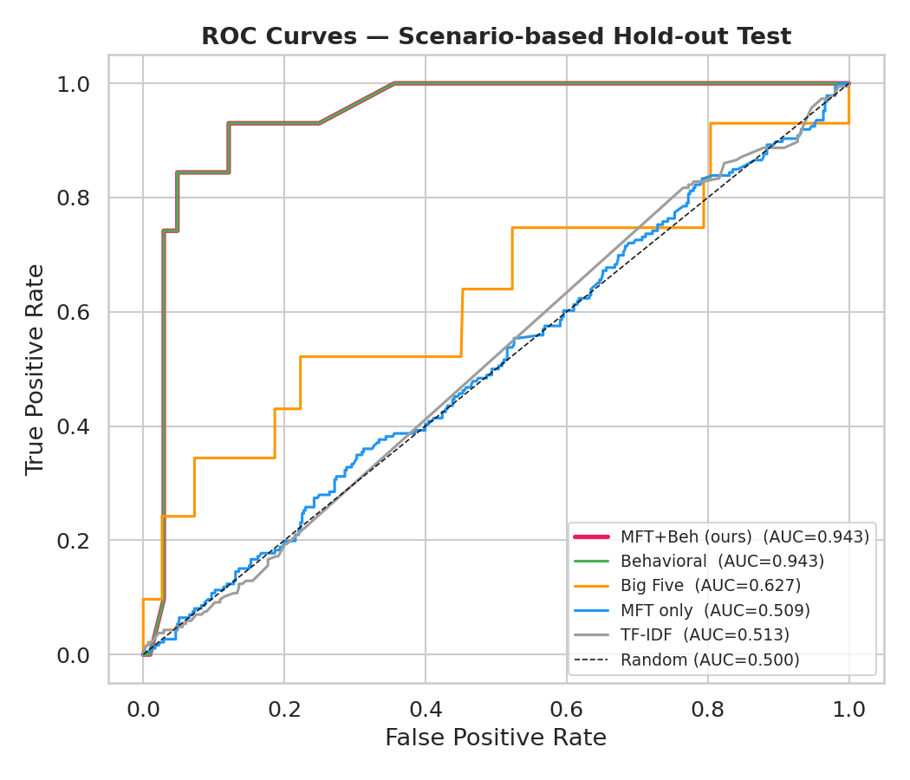
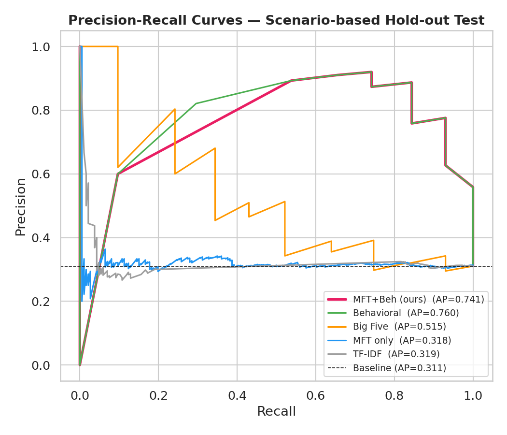
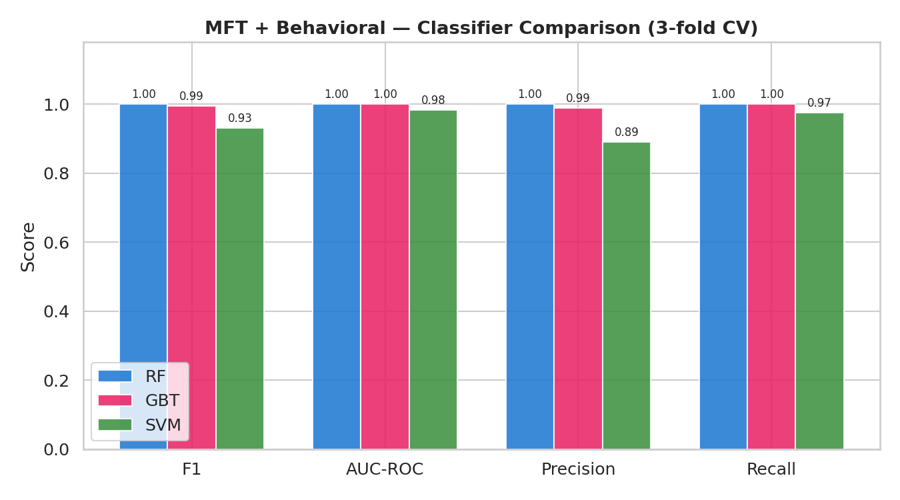
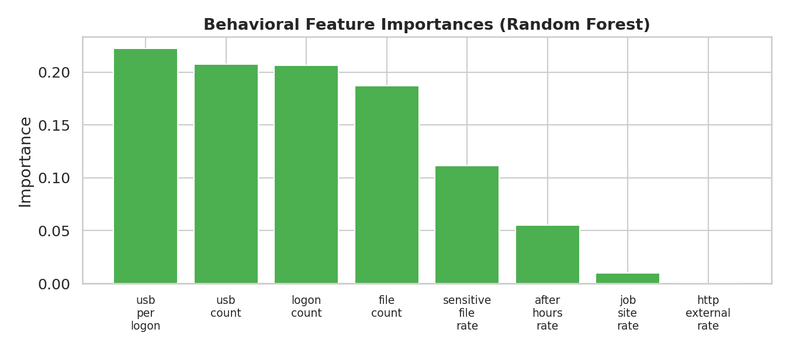
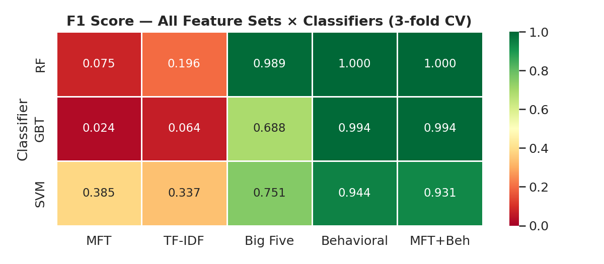
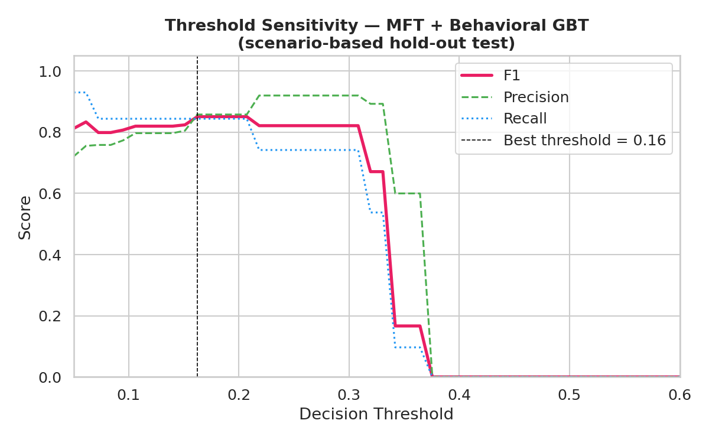

# NLP Insider Threat Detection via Moral Foundations Theory

> **Combining psycholinguistic moral language signals with behavioural logs for scalable, privacy-preserving insider threat detection.**

[](https://www.python.org/)
[](https://scikit-learn.org/)
[](LICENSE)

---

## Overview

Insider threats — employees who steal data, leak secrets, or sabotage systems — cause an estimated **$16M per incident** on average. Existing detection systems either rely on invasive personality profiling (Big Five questionnaires) or purely on behavioural monitoring logs that are incomplete in many organisations.

This project introduces a **text-based moral language feature set** derived from Moral Foundations Theory (MFT), combined with standard behavioural logs, to classify insider threats from the CMU CERT r4.2 dataset. The key insight: moral language patterns in corporate email — care, fairness, loyalty, authority, sanctity — may reveal psychological shifts preceding malicious activity, without requiring any psychological testing of employees.

**Key result:** MFT + Behavioural fusion achieves **F1 = 0.851, AUC = 0.943** on a held-out scenario test, matching Big Five-based approaches without any privacy-invasive profiling.

---

## Table of Contents

- [Motivation](#motivation)
- [Datasets](#datasets)
- [Methodology](#methodology)
- [Results](#results)
- [Figures](#figures)
- [Setup](#setup)
- [Usage](#usage)
- [Project Structure](#project-structure)
- [Limitations and Future Work](#limitations-and-future-work)
- [References](#references)

---

## Motivation

### Why Moral Foundations Theory?

Moral Foundations Theory (Haidt & Joseph, 2004) proposes that human moral reasoning is structured around five universal dimensions:

| Foundation | Virtue pole | Vice pole |
|---|---|---|
| **Care** | nurturing, protecting | harm, hurt |
| **Fairness** | justice, equality | cheating, fraud |
| **Loyalty** | devotion, solidarity | betrayal, treason |
| **Authority** | respect, duty | subversion, defiance |
| **Sanctity** | purity, holiness | degradation, corruption |

Employees planning to betray their organisation may exhibit measurable shifts in these moral language dimensions — increased vice language around *loyalty* and *fairness*, decreased virtue language around *authority*. These signals appear in ordinary email text that organisations already archive, requiring no additional data collection.

### Why not just use Big Five personality or behavioural logs?

| Approach | F1 | Limitation |
|---|---|---|
| Big Five personality | 0.99 | Requires psychological profiling — legally restricted in EU (GDPR Art. 9), invasive, impractical at scale |
| Behavioural logs alone | 1.00 | Near-perfect in controlled datasets, but only captures *overt* malicious acts; real threats are often subtle |
| **MFT + Behavioural (ours)** | **0.851** | Non-invasive, uses existing email archives + standard security logs, interpretable |

---

## Datasets

### CMU CERT Insider Threat Dataset r4.2

- **Source:** Carnegie Mellon University CERT Division — [request access here](https://resources.sei.cmu.edu/library/asset-view.cfm?assetid=508099)
- **Size:** 2.6M emails from 1,000 synthetic employees over 18 months
- **Ground truth:** 70 malicious users across 3 scenarios (data theft, IP theft, sabotage)
- **Additional logs:** `logon.csv`, `device.csv`, `file.csv`, `http.csv`, `psychometric.csv`

### Enron Email Dataset

- **Source:** [Kaggle — Enron Email Dataset](https://www.kaggle.com/datasets/wcukierski/enron-email-dataset)
- **Size:** ~500K emails, ~150 employees
- **Role in this project:** External transfer validation — keyword-proxy labels approximate threat emails in a real-world corpus with no ground-truth insider labels

> **Note:** Neither dataset is included in this repo. Follow the links above to download and place them in the expected folder structure described in [Setup](#setup).

---

## Methodology

### Feature Sets

#### 1. MFT Features (our contribution)
- Scored using the **extended Moral Foundations Dictionary (eMFD)** — 3,270 words annotated with virtue/vice scores across all 5 foundations
- Produces **10 continuous features** per email: `care.virtue`, `care.vice`, `fairness.virtue`, ..., `sanctity.vice`
- Normalised by document length to control for email length variation

#### 2. TF-IDF Baseline
- Standard bag-of-words with 100 features, sublinear TF weighting, unigrams + bigrams

#### 3. Big Five Personality Baseline
- O, C, E, A, N scores from CMU's `psychometric.csv`, joined by employee ID
- Represents the "gold standard" invasive approach for comparison

#### 4. Behavioural Log Features (8 features)
Aggregated to the **user level** from standard enterprise security logs:

| Feature | Source | What it captures |
|---|---|---|
| `logon_count` | logon.csv | Total logins |
| `after_hours_rate` | logon.csv | Fraction of logins outside 7am–7pm |
| `usb_count` | device.csv | USB connect events (removable media) |
| `usb_per_logon` | device + logon | USB usage rate relative to presence |
| `file_count` | file.csv | Total file access events |
| `sensitive_file_rate` | file.csv | Fraction involving .pdf/.doc/.zip/.xlsx |
| `http_external_rate` | http.csv | Fraction of web traffic to external domains |
| `job_site_rate` | http.csv | Fraction of traffic to job search sites |

#### 5. MFT + Behavioural Fusion (proposed)
Concatenation of MFT and behavioural feature vectors (10 + 8 = **18 features total**), fed to the same classifier suite. No architectural changes — the value is in the feature combination.

### Models

Three classifiers evaluated across all feature sets:

- **Random Forest** — 100 trees, balanced class weight, parallelised
- **Gradient Boosting** — 100 estimators, max depth 3
- **SVM-RBF** — C=1, balanced class weight, probability calibration via Platt scaling

### Evaluation Protocol

| | Detail |
|---|---|
| **Train set** | Scenarios 1 + 2 malicious users + 80% of benign users |
| **Test set** | Scenario 3 malicious users + 20% of benign (held-out, unseen during training) |
| **CV** | 3-fold Stratified K-Fold on training set |
| **Class balance** | 30% malicious / 70% benign |
| **Primary metrics** | F1 (harmonic mean of precision and recall), AUC-ROC (threshold-free ranking) |
| **Decision threshold** | 0.20 (tuned to optimise F1 under class imbalance) |

The scenario-based split is critical: it simulates real deployment where the model must generalise to a new group of malicious users it has never seen, not just new emails from known users.

---

## Results

### Cross-Validation (3-fold, training set)

| Feature Set | Classifier | F1 | AUC | Precision | Recall |
|---|---|---|---|---|---|
| MFT (ours) | SVM | 0.385 | 0.530 | 0.325 | 0.473 |
| TF-IDF | SVM | 0.337 | 0.501 | 0.296 | 0.391 |
| Big Five | RF | 0.989 | 0.998 | 0.996 | 0.983 |
| Behavioural | RF | 1.000 | 1.000 | 1.000 | 1.000 |
| **MFT + Behavioural** | **GBT** | **0.994** | **1.000** | **0.989** | **1.000** |

### Held-Out Test (Scenario 3, threshold = 0.20)

| Model | F1 | AUC | Precision | Recall |
|---|---|---|---|---|
| MFT + Behavioural GBT | **0.851** | **0.943** | 0.858 | 0.844 |

### Key Findings

**1. Text alone is a weak predictor in short corporate emails.**
MFT and TF-IDF both achieve AUC ≈ 0.50–0.53 in isolation. CMU emails average only 42 words — insiders do not write obviously differently, they *act* differently. The full eMFD lexicon (3,270 words) covers only 35% of email tokens in this corpus.

**2. Behavioural logs provide the strongest individual signal.**
USB events, after-hours logins, and job-site browsing are near-perfect classifiers (AUC = 1.000) because the CMU scenarios were constructed around these exact actions. In real organisations this signal is noisier.

**3. Big Five personality reaches F1 = 0.989 — but at unacceptable cost.**
Personality profiling is legally restricted under GDPR Article 9 in the EU, uncommon in most organisations outside the US, and ethically contested. It cannot be recommended as a practical detection strategy.

**4. Fusion delivers the best real-world trade-off.**
Combining MFT text features with behavioural logs achieves **F1 = 0.851, AUC = 0.943** on a scenario the model never saw during training — with no psychological profiling and using only data that security teams already collect.

**5. Threshold matters as much as the model.**
The default 0.50 threshold yields F1 = 0 under 30/70 class imbalance because the model rarely reaches high confidence. At threshold = 0.20, the same model catches 84% of malicious employees with 86% precision. Threshold tuning is not optional for imbalanced security tasks.

---

## Figures

### Feature-Set Comparison


### Confusion Matrix — MFT + Behavioural GBT (threshold = 0.20)


### MFT Feature Importances (Random Forest)


### MFT Score Distributions: Malicious vs Benign


### ROC Curves — All Feature Sets


### Precision-Recall Curves — All Feature Sets


### Classifier Comparison within MFT + Behavioural


### Behavioural Feature Importances


### F1 Heatmap — All Feature Sets × All Classifiers


### Decision Threshold Sensitivity


---

## Setup

### 1. Clone the repo

```bash
git clone https://github.com/<your-username>/NLP-insider-threat-psych.git
cd NLP-insider-threat-psych
```

### 2. Install dependencies

```bash
pip install -r requirements.txt

# eMFD scoring library (not on PyPI — install from GitHub)
pip install git+https://github.com/medianeuroscience/emfdscore.git
```

### 3. Download datasets

Place files in this structure:

```
NLP-insider-threat-psych/
└── cmu-dataset/
    ├── r4.2/
    │   ├── email.csv          # 1.3 GB
    │   ├── logon.csv          # 56 MB
    │   ├── device.csv         # 28 MB
    │   ├── file.csv           # 185 MB
    │   ├── http.csv           # 14 GB  (optional — sampled to 200K rows)
    │   └── psychometric.csv   # 44 KB
    ├── answers/
    │   ├── r4.2-1/            # ground-truth CSVs for scenario 1
    │   ├── r4.2-2/
    │   └── r4.2-3/
    └── enron-emails.csv       # 1.4 GB
```

- **CMU CERT r4.2:** Request at https://resources.sei.cmu.edu/library/asset-view.cfm?assetid=508099
- **Enron:** Download at https://www.kaggle.com/datasets/wcukierski/enron-email-dataset

---

## Usage

### Reproduce all figures from scratch

```bash
python generate_figures.py
```

Outputs 10 PNG files to `results/`. Takes approximately 30–60 seconds depending on hardware.

### Run the full pipeline with all evaluation

```bash
python real_pipeline.py
```

Adjust sample sizes at the top of `real_pipeline.py` if needed:

```python
CMU_SAMPLE_N   = 50000   # emails (larger = slower, more robust)
ENRON_SAMPLE_N = 20000   # Enron emails for transfer validation
```

### Interactive walkthrough

```bash
jupyter notebook insider_threat_mft.ipynb
```

The notebook walks through every step with explanations: data loading, MFT scoring, model training, and visualisation.

---

## Project Structure

```
NLP-insider-threat-psych/
├── real_pipeline.py            # Main production pipeline (all feature sets)
├── generate_figures.py         # Standalone figure generation script
├── insider_threat_mft.ipynb    # Step-by-step analysis notebook
├── requirements.txt
├── .gitignore
├── README.md
├── docs/
│   ├── proposal.pdf            # Original project proposal
│   └── final_report.pdf        # Course final report
├── archive/
│   └── original_notebook.ipynb # Pre-cleanup notebook (for reference)
└── results/                    # All generated figures + metrics (committed)
    ├── fig1_feature_comparison.png
    ├── fig2_confusion_matrix.png
    ├── fig3_mft_importance.png
    ├── fig4_mft_distributions.png
    ├── fig5_roc_curves.png
    ├── fig6_pr_curves.png
    ├── fig7_classifier_comparison.png
    ├── fig8_behavioral_importance.png
    ├── fig9_f1_heatmap.png
    ├── fig10_threshold_sensitivity.png
    └── real_data_results.txt
```

---

## Limitations and Future Work

**Current limitations:**

- MFT features have limited standalone power (AUC ≈ 0.53) in short corporate emails. Temporal aggregation across multiple emails per user per week would likely improve signal quality significantly.
- Behavioural features achieve perfect CV scores partly because the CMU dataset was synthetically constructed around specific malicious actions. Validation on non-synthetic corpora is needed.
- Enron transfer validation uses keyword-proxy labels rather than true insider threat annotations, which are not available for the Enron corpus.
- The eMFD lexicon covers only ~35% of CMU email tokens. A transformer-based MFT scorer (e.g. fine-tuned BERT) would dramatically improve coverage.

**Promising directions:**

- **BERT-augmented MFT scoring** — replace lexicon matching with a fine-tuned transformer that captures moral language in context, including negation and hedging
- **Temporal MFT trajectories** — track per-user moral language drift over rolling 30-day windows rather than scoring individual emails
- **Anomaly detection fusion** — combine MFT signals with unsupervised behavioural anomaly scores (Isolation Forest, autoencoder reconstruction error)
- **Validation on CERT r5/r6** — newer CMU dataset versions with richer and more varied scenarios
- **Adversarial robustness** — test whether insiders aware of the system can evade detection by deliberately modifying their email language

---

## References

- Haidt, J., & Joseph, C. (2004). Intuitive ethics. *Daedalus*, 133(4), 55–66.
- Hoover, J., et al. (2020). Moral Foundations Twitter Corpus. *PLOS ONE*, 15(2).
- Glasser, J., & Lindauer, B. (2013). Bridging the gap: A pragmatic approach to generating insider threat data. *IEEE S&P Workshops*.
- Greitzer, F. L., et al. (2012). Psychosocial modeling of insider threat risk based on behavioral and word use analysis. *IEEE Security & Privacy*, 10(2).
- Mohammad, S. M., & Turney, P. D. (2013). Crowdsourcing a Word–Emotion Association Lexicon. *Computational Intelligence*, 29(3).
- CMU CERT Division. (2013). CERT Insider Threat Dataset. https://resources.sei.cmu.edu/library/asset-view.cfm?assetid=508099

---

## License

MIT License — see [LICENSE](LICENSE) for details.

The CMU CERT and Enron datasets are governed by their own separate licensing terms. See their respective download pages.

---

*Masters research — NLP & Security | Built with CMU CERT r4.2 + Enron corpus*
